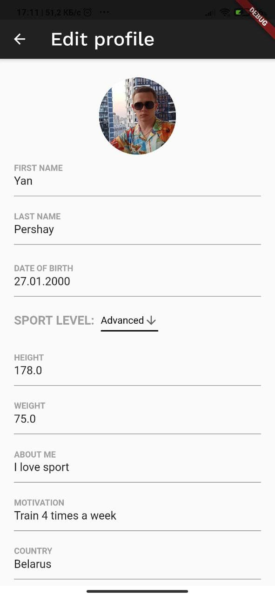

# SportHUB

This project is a sports social network. 
"Instagram for athletes".
Provides the opportunity to share sports experience between users, publish your progress in maintaining a healthy lifestyle, read articles on sports topics, mutually subscribe, like and leave comments.

After launching the application, an authorization form opens.

 

If the user is not registered, you need to go to the registration page and fill out the profile.If the user is not registered, you need to go to the registration page and fill out the profile.

 

After registration, the user can go to his profile and see, evaluate his publications.

 

The user can go to the "Blog" tab and read various articles on sports topics.

 

If the user has the "Trainer" role, then he can create a new blog article. To do this, you need to fill in the title, select the duration, complexity, select images and write the text.

 

You can crop the image if you want.

 

If everything suits you, you can send a pack and it will appear on the blog.

 

Users can mutually subscribe. The list of subscribers and those to whom you are subscribed can be viewed on the "Friends" tab.

 

User can search other users by username or by Furstname/Lastname.

 

Users can mutually subscribe. 

 

When you subscribe to a user, his posts appear in the news feed.

 

You can create your own publication.

 

User can delete his post publication.

 

You can like and comment.

 

You can save posts. Saved publications will appear in the "Saved" section

 

User can edit account data, profile.

 